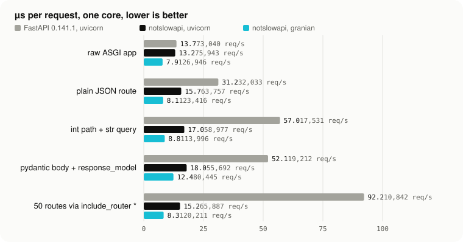

<p align="center">
  <picture>
    <source media="(prefers-color-scheme: dark)" srcset="site/landing/assets/logo-dark.svg">
    
  </picture>
</p>

<p align="center"><strong>FastAPI, minus the slow.</strong></p>

<p align="center">A fork of FastAPI 0.141.1 that does less work per request: the same public API and test suite, with the plain JSON route down from 31.2 to 15.8 µs on uvicorn and 8.5 µs on granian.</p>

<p align="center">
  <a href="https://pypi.org/project/notslowapi"></a>
  <a href="https://pypi.org/project/notslowapi"></a>
  <a href="https://github.com/4thel00z/notslowapi/actions/workflows/ci.yml"></a>
  <a href="https://github.com/4thel00z/notslowapi/actions/workflows/release.yml"></a>
  <a href="#license"></a>
</p>

## Install

```console
uv add notslowapi[granian]
```

```console
pip install "notslowapi[granian]"
```

Python 3.10 to 3.14 and `pydantic>=2.9.0`. Pydantic v1 is not supported. The base install brings no ASGI server; the `granian` extra adds `granian>=2.0`. The `standard` extra is FastAPI's minus `fastapi-cli`, which would pull the PyPI `fastapi` package back in; it adds httpx, jinja2, python-multipart, email-validator, `uvicorn[standard]`, pydantic-settings and pydantic-extra-types. Nothing is installed under the `fastapi` or `starlette` names.

## Switch

```python
from notslowapi import FastAPI
```

Replace the package name `fastapi` with `notslowapi` in every import.

## Run

```console
granian --interface asgi --workers 1 --loop uvloop myapp:app
```

`myapp:app` is the module path and attribute of your `FastAPI` instance. granian's I/O runs on Rust threads alongside the Python thread, so the framework's Python is the only thing left on the critical path. On the bare ASGI callable the server alone costs 7.8 µs per request under granian against 13.5 µs under uvicorn, and the notslowapi route adds 0.6 µs on top of that under granian against 2.4 µs under uvicorn.

If you stay on uvicorn, `uvicorn[standard]` gives you uvloop and httptools (15.8 µs on the plain route against 64.0 µs on asyncio and h11), and the three `--no-*` flags are worth about 5 percent unless you sit behind a proxy that sets `X-Forwarded-*` headers:

```console
uvicorn myapp:app --loop uvloop --http httptools --no-proxy-headers --no-server-header --no-date-header
```

## Numbers

One core (Apple M3 Pro, Python 3.13), 64 keep-alive connections, median of 3 x 5 s oha runs, one worker. The first column is upstream FastAPI 0.141.1 on uvicorn at the start of the work (`bench/baseline/results_ladder_v1.json`); the other two are the current master (all 37 changes) from `bench/baseline/results_ladder_v4.json`.

| route | day one, uvicorn (FastAPI 0.141.1) | notslowapi, uvicorn | notslowapi, granian |
|---|---|---|---|
| raw ASGI app, fixed bytes (server floor) | 13.7 µs, 73,040 req/s | 13.4 µs, 74,846 req/s | 7.9 µs, 126,443 req/s |
| plain JSON route | 31.2 µs, 32,033 req/s | 15.8 µs, 63,374 req/s | 8.5 µs, 117,318 req/s |
| int path + str query param | 57.0 µs, 17,531 req/s | 18.3 µs, 54,769 req/s | 9.0 µs, 111,149 req/s |
| pydantic body + response_model | 52.1 µs, 19,212 req/s | 21.1 µs, 47,445 req/s | 14.1 µs, 71,011 req/s |
| 50 routes via include_router | 92.2 µs, 10,842 req/s * | 16.7 µs, 59,862 req/s | 8.5 µs, 117,379 req/s |
| three dependencies (path, header, query via Depends) | not measured | 25.0 µs, 39,953 req/s | 14.9 µs, 67,232 req/s |

<p align="center">
  <picture>
    <source media="(prefers-color-scheme: dark)" srcset="site/landing/assets/numbers-dark.svg">
    
  </picture>
</p>

\* This rung did not exist in `results_ladder_v1.json`. The 92.2 µs is the before-run of the include_router change (`bench/baseline/results_fix11_before.json`), measured on a tree that already had the first ten changes, so it understates the day-one gap.

The before/after figures in the next section are same-window runs from the commit messages. They differ from the full-ladder figures above by a few percent, as [Benchmark method](https://notslowapi.com/docs/benchmarks-method/) explains.

## What changed

Each change is one commit under `vendor/` with a same-window before and after, in µs per request on uvicorn unless marked granian. The largest wins:

- Routing: an index per routes version maps each static path to the routes that can match it, included routes are matched once instead of twice, and exact static-path hits skip `matches()`. 50 routes via `include_router`: 92.2 → 31.7 (10.8k → 31.6k req/s); 50 plain routes: 36.3 → 25.2. Included static routes are then dispatched inline: 50 routes via `include_router`: 26.6 → 20.6 (granian 17.5 → 10.7).
- Parameter extraction: `ModelField` computes `is_sequence`, alias, `is_model` and location once instead of per request, and `QueryParams` parses in one loop. int path + str query: 50.7 → 35.3 (19.7k → 28.3k req/s), later 24.8 → 22.4.
- Dependency solver: no throwaway `Response`, and query string, headers and cookies are parsed only when the route needs them; endpoints with no dependencies or parameters skip the solver. Plain route: 31.0 → 26.3; pydantic body: 42.7 → 36.7; plain route on granian: 14.0 → 10.6.
- Request handler built once: included routes no longer rebuild their handler per request, routes without a body parameter or streaming get a specialized handler, and coroutine endpoints serialize synchronously through pydantic-core. Route via `include_router`: 33.4 → 29.2; pydantic body: 36.5 → 32.3.
- Exception handling and dispatch frames: without user middleware, `ServerErrorMiddleware`, `ExceptionMiddleware` and the router became one `ExceptionHandlingMiddleware`; `APIRoute.handle`, `FastAPI.__call__` and `request_response` each dropped a frame. Plain route: 24.6 → 23.8, then 18.9 → 18.2; Starlette route: 17.5 → 16.8 (granian 10.2 → 9.4).
- Exit stacks only where needed: routes decide at build time whether they need an `AsyncExitStack`, and `AsyncExitStackMiddleware` is no longer installed. Plain route: 26.3 → 25.4, then 23.8 → 22.7.
- JSON encoding: content-type headers come from a cache, `JSONResponse` reuses one encoder, and `jsonable_encoder` returns plain values unchanged when no include, exclude or custom encoder is set. Untyped dict return: 20.3 → 18.0 (49.2k → 55.4k req/s).

The full list with every measurement is at [What changed](https://notslowapi.com/docs/what-changed/).

## Compatibility

notslowapi has the public API of FastAPI 0.141.1: classes, functions, parameters and behaviors are upstream's, and the changes are internal. The check is the upstream test suite with its imports rewritten: 4,563 tests pass, and the three files that need packages this repo does not install (fastapi-cli, strawberry, the OpenTelemetry SDK) are skipped. The modified Starlette 1.6.0 ships inside the package as `notslowapi.starlette` and nothing is installed under the `starlette` name, so code that imports `starlette.*` directly needs upstream Starlette installed and gets upstream behavior for those objects.

The three observable internal differences and the behaviors probed before and after each change are listed at [Compatibility](https://notslowapi.com/docs/compatibility/).

## Repository

- `vendor/fastapi`: the fork, Python package `notslowapi`, a git subtree of github.com/4thel00z/fastapi with upstream history intact. `vendor/fastapi/pyproject.toml` is what gets built and published.
- `vendor/fastapi/notslowapi/starlette`: the modified Starlette 1.6.0, shipped as `notslowapi.starlette`.
- `bench/`: the benchmark ladder (`bench/apps.py`, `bench/run.py`, `bench/compare.py`) and `bench/baseline/` with the JSON for every measurement.
- `site/`: notslowapi.com; `site/landing/` is the front page, `site/docs/` the docs, and `site/build.py` renders the benchmark tables from `bench/baseline/`.
- `.github/workflows/`: `ci.yml` runs ruff on both trees and the test suite; `release.yml` builds from `v*.*.*` tags and publishes to PyPI.

## Benchmarks and tests

The ladder needs `oha` on `PATH`; granian comes from the `bench` dependency group. Each rung is warmed for 2 s, then loaded three times for 5 s at 64 connections.

```console
uv run python -m bench.run
BENCH_ONLY=l2_fastapi_dict,l3_fastapi_params uv run python -m bench.run
uv run python bench/compare.py bench/baseline/results_fix1_before.json bench/baseline/results_fix1_after.json
```

`BENCH_REPEATS`, `BENCH_DURATION` and `BENCH_CONCURRENCY` override 3, 5s and 64. `BENCH_SAMPLE=1` and `BENCH_PYINSTRUMENT=1` write profiles to `bench/out/`.

The merged test suite:

```console
uv sync --group test
cd vendor/fastapi
uv run --project ../.. pytest tests --ignore=tests/benchmarks --ignore=tests/memory_benchmarks
```

CI adds `--ignore` flags for the benchmark and GraphQL tutorial directories; see `.github/workflows/ci.yml`.

## Links

- Site: [notslowapi.com](https://notslowapi.com)
- Docs: [notslowapi.com/docs/](https://notslowapi.com/docs/)
- Benchmark tables: [notslowapi.com/benchmarks/](https://notslowapi.com/benchmarks/)
- Issues: [github.com/4thel00z/notslowapi/issues](https://github.com/4thel00z/notslowapi/issues)

## License

The FastAPI code is MIT licensed, copyright 2018 Sebastián Ramírez ([vendor/fastapi/LICENSE](vendor/fastapi/LICENSE)). The vendored Starlette is BSD-3-Clause, copyright 2018 Encode OSS Ltd ([vendor/fastapi/notslowapi/starlette/LICENSE.md](vendor/fastapi/notslowapi/starlette/LICENSE.md)). Both files ship in the wheel; the package metadata declares `MIT`.
